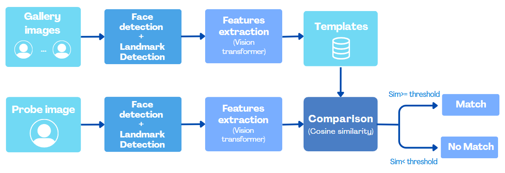
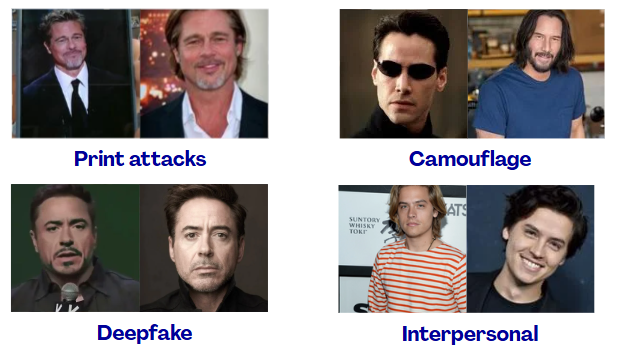

# Face Verification with Vision Transformer (ViT + ArcFace)

This project evaluates the performance of a **Vision Transformer (ViT)** trained with **ArcFace loss** for **face verification** under appearance variations and spoofing attacks.

The work was developed for the **Biometrics Systems** course (Academic Year 2025/2026) and focuses on analyzing robustness in realistic scenarios such as aging, makeup, camouflage, plastic surgery and attacks (print and deepfake).

---

## Project Overview

The system follows a classical **face verification pipeline**:

1. **Face detection & landmark extraction** using RetinaFace  
2. **Face alignment** based on the ArcFace 5-point template  
3. **Feature extraction** using a ViT trained with ArcFace  
4. **Similarity computation** via cosine similarity  
5. **Evaluation** using biometric metrics (FAR, FRR, ROC, DET, EER)

The goal is to assess how well a modern transformer-based model performs in challenging biometric conditions.

---

## Models used

### Face Detection & Alignment
- **RetinaFace** (via [insightface](https://github.com/deepinsight/insightface), Buffalo-L model pack)
- 5-point facial landmarks (eyes, nose, mouth corners)
- Alignment using affine transformation to ArcFace standard (112×112)

### Face Recognition
- **Vision Transformer (ViT)** [via Huggingface](https://huggingface.co/gaunernst/vit_tiny_patch8_112.arcface_ms1mv3)
- Output: **512-dimensional L2-normalized embeddings**

---

## Dataset

### Gallery
- 212 images of well-known identities  
- 3 images per identity  
- Controlled and uncontrolled conditions

### Test Set Categories
- **User variations**
  - Age
  - Make-up
  - Plastic surgery
  - Camouflage
- **Attack scenarios**
  - Print attack
  - Deepfake
  - Inter-personal (Look-alikes / similar identities)

---

## Evaluation Metrics

The system is evaluated using standard biometric metrics:

- **FAR** – False Acceptance Rate  
- **FRR** – False Rejection Rate  
- **GAR / GRR**  
- **Equal Error Rate (EER)**  
- **ROC and DET curves**  
- **Threshold analysis per subset**

Each probe image is compared against all gallery identities to generate genuine and impostor score distributions.

---

## Results

- Excellent performance under **age**, **camouflage**, and **inter-personal** variations
- **Make-up** is the most challenging appearance change
- **Print attacks and deepfakes are accepted** as genuine identities  
- Strong identity discrimination, but **no liveness detection**

---

## Limitations

- No anti-spoofing or liveness detection
- Thresholds vary significantly across subsets
- Not suitable alone for security-critical applications

---

## 😼 Author
[A. Infantino 1922069](https://github.com/alessiainf)
